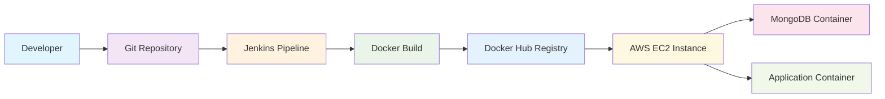
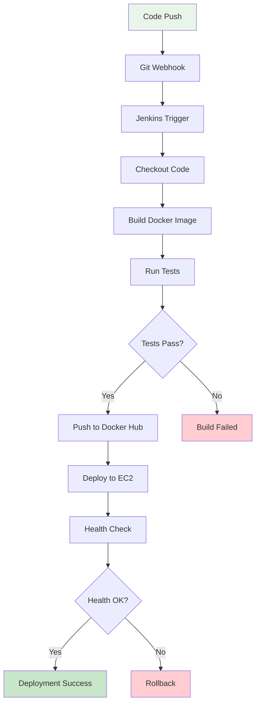
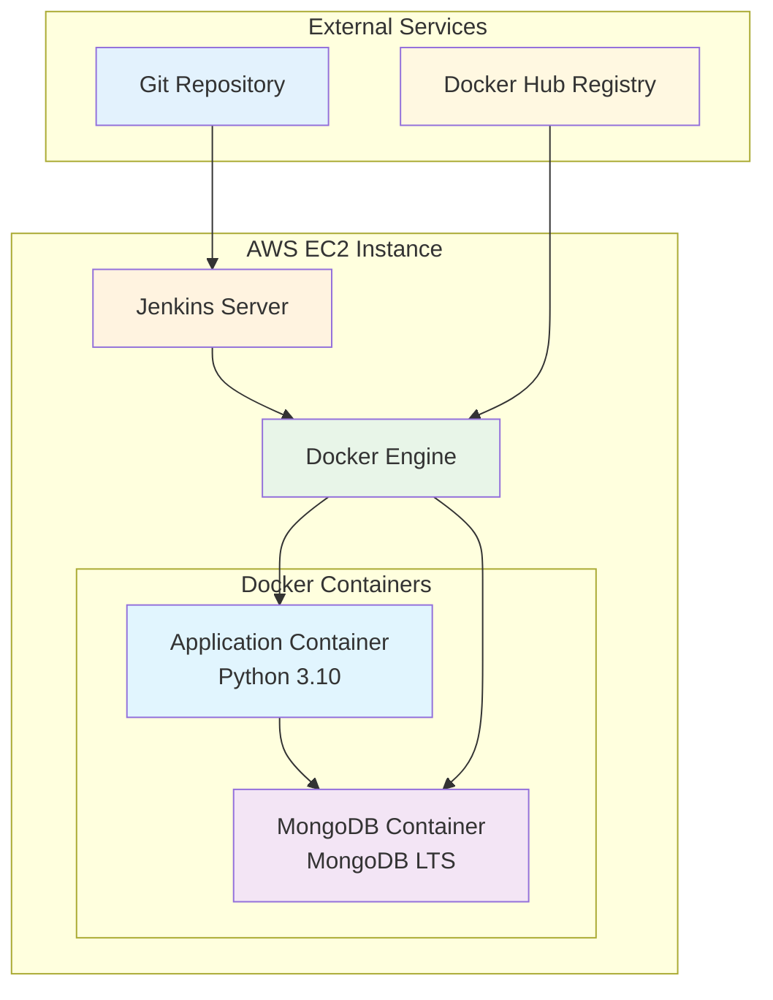
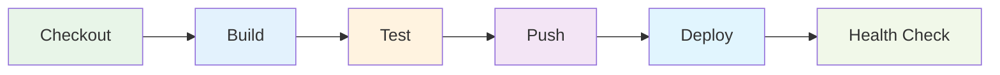
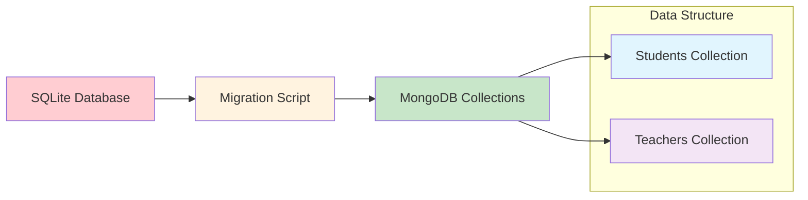
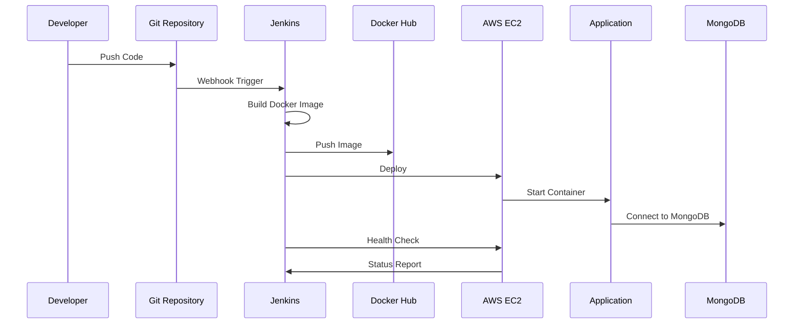
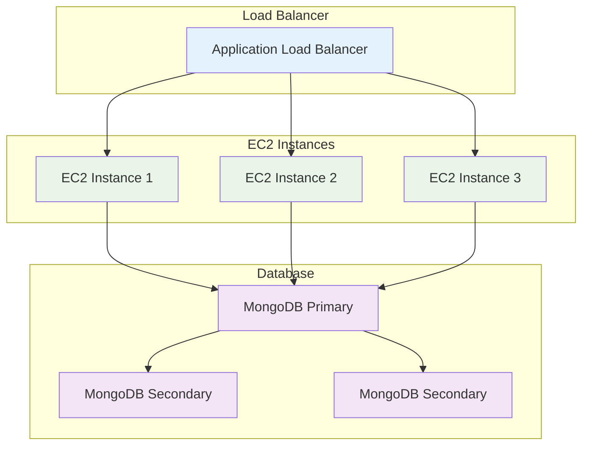

# Student Interaction Tracker - DevOps Deployment

A complete CI/CD pipeline for deploying a student voice tracking system using Docker, Jenkins, MongoDB, and AWS EC2.

## 🚀 **Deployment Architecture**



## 🔄 **CI/CD Pipeline Flow**



## 🏗️ **System Architecture**



## 🏗️ **Technology Stack**

- **Containerization**: Docker & Docker Compose
- **CI/CD**: Jenkins Pipeline
- **Database**: MongoDB (NoSQL)
- **Cloud**: AWS EC2
- **Registry**: Docker Hub
- **Language**: Python 3.10

## 📋 **Prerequisites**

- AWS EC2 instance (Ubuntu 22.04 LTS)
- Jenkins server (installed on EC2)
- Docker Hub account
- Git repository

## 🛠️ **Quick Start**

### 1. **Clone and Setup**
```bash
git clone <your-repository-url>
cd student-interaction-tracker
```

### 2. **Local Testing**
```bash
# Test Docker build
docker build -t student-interaction-tracker .

# Test with Docker Compose
docker-compose up --build
```

### 3. **Deploy to Production**
```bash
# Push code to trigger Jenkins pipeline
git add .
git commit -m "Update application"
git push origin main
```

## 🔧 **Jenkins Pipeline Configuration**

### **Pipeline Stages:**


1. **Checkout** - Pull code from Git
2. **Build** - Create Docker image
3. **Test** - Run MongoDB connection tests
4. **Push** - Upload to Docker Hub
5. **Deploy** - Deploy to EC2
6. **Health Check** - Verify deployment

### **Jenkins Setup:**
1. Install Jenkins on EC2
2. Install required plugins:
   - Docker Pipeline
   - Git Plugin
   - Pipeline
   - Credentials Binding
3. Configure credentials:
   - Docker Hub credentials (`docker-hub-credentials`)
4. Create pipeline job pointing to `Jenkinsfile`

## 🐳 **Docker Configuration**

### **Dockerfile**
```dockerfile
FROM python:3.10-slim
WORKDIR /app
COPY requirements.txt .
RUN pip install -r requirements.txt
COPY . .
CMD ["python3", "main.py"]
```

### **Docker Compose**
```yaml
version: '3.8'
services:
  db:
    image: mongo:lts
    environment:
      MONGO_INITDB_ROOT_USERNAME: user
      MONGO_INITDB_ROOT_PASSWORD: password
      MONGO_INITDB_DATABASE: studentdb
    volumes:
      - mongodata:/data/db

  app:
    image: dockerpilot17/student-interaction-tracker:latest
    depends_on:
      - db
    environment:
      MONGO_URL: mongodb://user:password@db:27017/studentdb?authSource=admin
      DB_NAME: studentdb
```

## 📊 **Database Migration**

### **From SQLite to MongoDB**
The application has been migrated from SQLite to MongoDB for better scalability:



- **Migration Script**: `migrate_to_mongodb.py`
- **Database Operations**: `db.py` (MongoDB implementation)
- **Test Script**: `test_mongodb.py`

### **Data Structure**
```javascript
// Students Collection
{
  "roll_no": "string",
  "embedding_path": "string", 
  "time": "number"
}

// Teachers Collection
{
  "teacher_id": "string",
  "embedding_path": "string"
}
```

## 🔄 **Deployment Process**

### **Automated Deployment**


1. **Code Push** triggers Jenkins pipeline
2. **Jenkins** builds Docker image
3. **Docker Hub** stores the image
4. **EC2** pulls and runs the image
5. **MongoDB** stores application data
6. **Health checks** verify deployment

### **Manual Deployment**
```bash
# On EC2 instance
./deploy.sh deploy
```

## 📁 **Project Structure**

```
student-interaction-tracker/
├── main.py                 # Main application
├── db.py                   # MongoDB operations
├── embedding.py            # Voice embedding processing
├── diarization.py          # Speaker diarization
├── Dockerfile              # Docker configuration
├── docker-compose.yml      # Container orchestration
├── Jenkinsfile             # CI/CD pipeline
├── deploy.sh               # Deployment script
├── requirements.txt        # Python dependencies
├── test_mongodb.py         # Database tests
├── migrate_to_mongodb.py   # Data migration
└── README.md               # This file
```

## 🔍 **Monitoring & Maintenance**

### **Health Checks**
```bash
# Check container status
docker-compose ps

# View application logs
docker-compose logs -f app

# Check database connection
docker-compose exec db mongosh --eval "db.runCommand({ping: 1})"
```

### **Backup & Recovery**
```bash
# Create backup
./deploy.sh backup

# Rollback deployment
./deploy.sh rollback
```

## 🚨 **Troubleshooting**

### **Common Issues**

1. **Docker Permission Issues**
   ```bash
   sudo usermod -aG docker jenkins
   sudo systemctl restart jenkins
   ```

2. **MongoDB Connection Issues**
   ```bash
   docker-compose logs db
   docker-compose restart db
   ```

3. **Jenkins Build Failures**
   - Check Jenkins console output
   - Verify Docker Hub credentials
   - Ensure Git repository is accessible

### **Logs Location**
- **Application**: `docker-compose logs app`
- **Database**: `docker-compose logs db`
- **Jenkins**: `/var/log/jenkins/jenkins.log`

## 🔐 **Security Considerations**

- MongoDB authentication enabled
- Docker containers run with limited privileges
- Environment variables for sensitive data
- Regular security updates

## 📈 **Scaling Options**

### **Horizontal Scaling**


- Multiple EC2 instances behind load balancer
- MongoDB replica set for high availability
- Docker Swarm or Kubernetes for orchestration

### **Vertical Scaling**
- Larger EC2 instance types
- MongoDB Atlas for managed database
- Enhanced monitoring and alerting

## 🤝 **Contributing**

1. Fork the repository
2. Create feature branch
3. Make changes
4. Test locally with Docker
5. Push and create pull request

## 📞 **Support**

- **Repository**: [GitHub Repository URL]
- **Docker Hub**: [dockerpilot17/student-interaction-tracker]
- **Issues**: Create GitHub issue for bugs/features

---

**Deployed By**: [Your Name]  
**Last Updated**: [Date]  
**Version**: 1.0
